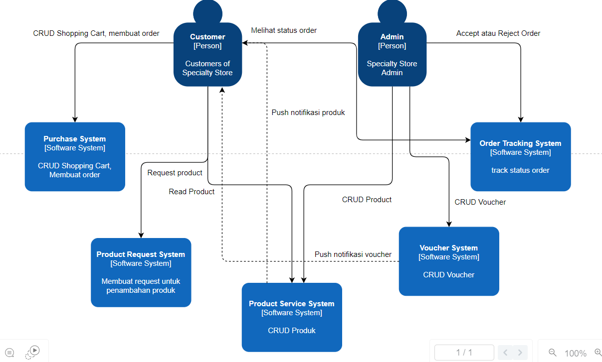
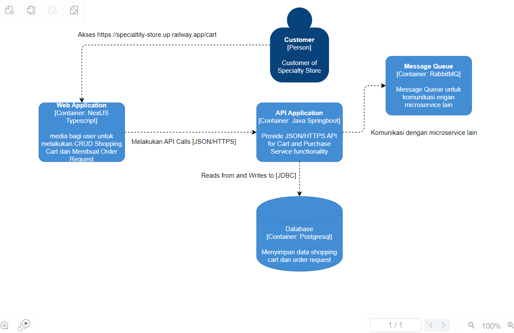
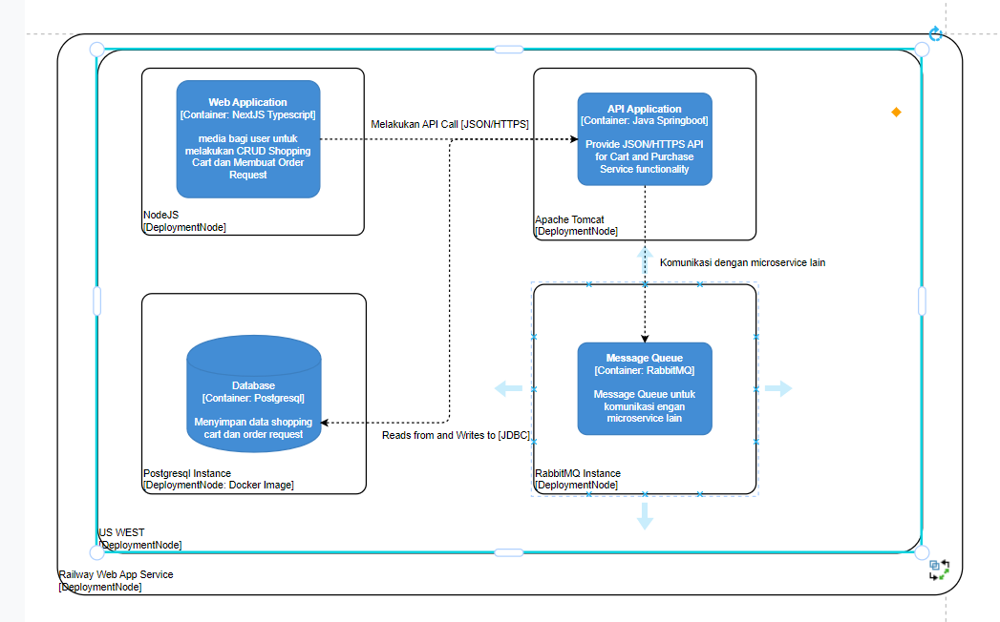

### 

Risiko Arsitektur Specialty Store Adpro C4
Contributed by Isa Citra Buana
----------------------------------------------
1. Integritas Data
   Identifikasi: Kami hanya memanfaatkan message queue dalam porsi kecil dan masih menggunakan pendekatan chain REST API yang tradisional. Tidak ada mekanisme rollback untuk menangani error jika transaksi tidak sepenuhnya berhasil. Hal ini sering menyebabkan perbedaan integritas data antara satu microservice dengan yang lain.

Konsensus: Semua anggota setuju bahwa pendekatan ini menyebabkan ketidakselarasan data antar microservice dan dapat mengganggu keandalan sistem secara keseluruhan.

Mitigasi:

Memperluas penggunaan message queue untuk mengatur komunikasi antar microservice.
Mengimplementasikan distributed transactions atau eventual consistency untuk menjaga integritas data.
Menambahkan mekanisme rollback untuk menangani kegagalan transaksi.
2. Keamanan
   Identifikasi: API bersifat publik dan tidak menerapkan Cross-Origin Resource Sharing (CORS). Selain itu, autentikasi yang diterapkan belum menggunakan autentikasi dua faktor (2FA).

Konsensus: Semua anggota setuju bahwa kurangnya kontrol akses CORS dan autentikasi dua faktor (2FA) membuat sistem rentan terhadap serangan keamanan.

Mitigasi:

Menerapkan CORS untuk membatasi akses API hanya dari sumber yang terpercaya.
Mengimplementasikan autentikasi dua faktor (2FA) untuk meningkatkan keamanan akses pengguna dan admin.
Melakukan audit keamanan berkala dan uji penetrasi untuk mengidentifikasi dan memperbaiki celah keamanan.
3. Ketersediaan (Availability)
   Identifikasi: Belum ada replika untuk tiap microservice, sehingga jika satu microservice mengalami downtime, seluruh sistem bisa terkena dampaknya.

Konsensus: Semua anggota setuju bahwa kurangnya replikasi microservice dapat mengakibatkan downtime yang signifikan dan mengurangi ketersediaan sistem.

Mitigasi:

Implementasi replika untuk tiap microservice untuk meningkatkan ketersediaan sistem.
Menggunakan load balancer untuk mendistribusikan beban di antara beberapa instance microservice.
Menerapkan auto-scaling untuk menyesuaikan kapasitas server berdasarkan beban trafik.

-----------------------------------------------------